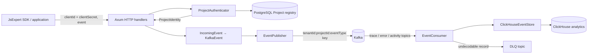

# JsExpert Stream

`jsexpert-stream` is the multi-tenant ingestion boundary for JsExpert. It authenticates an SDK request against the project registry, derives the tenant and project identifiers server-side, and publishes durable events to Kafka.

## Code layout

The executable is deliberately a small composition root. Each layer has one responsibility:

- `src/config.rs` — validated environment configuration and topic naming.
- `src/domain/` — event contracts, validation, identity, and partition-key rules.
- `src/auth.rs` — project credential authentication against PostgreSQL.
- `src/transport/http.rs` — HTTP request/response handling only.
- `src/transport/kafka.rs` — idempotent Kafka publishing and DLQ writes.
- `src/infrastructure/consumer.rs` — Kafka consumption and offset-commit policy.
- `src/infrastructure/clickhouse.rs` — analytical schema and durable event storage.

## Service objects

The service uses small, focused Rust structs and pure domain functions instead of a large shared handler. Dependencies are composed in `main.rs` and passed only to the layer that needs them.

| Object | Responsibility | Depends on |
| --- | --- | --- |
| `Config` | Loads required environment values and derives topic names. | Environment variables |
| `AppState` | Holds the HTTP layer's collaborators. | `ProjectAuthenticator`, `EventPublisher` |
| `ProjectAuthenticator` | Resolves trusted tenant and project identity from SDK credentials. | PostgreSQL |
| `IncomingEvent` | Validates an API event envelope and converts it to the internal event contract. | Pure domain validation |
| `ProjectIdentity` | The trusted, server-derived tenant and project pair. | Authentication query |
| `KafkaEvent` | The durable event contract used between the API, Kafka, and consumer. It owns partition-key construction. | Domain values |
| `EventPublisher` | Publishes idempotently to typed Kafka topics and writes malformed records to the DLQ. | Kafka, `Config` |
| `EventConsumer` | Consumes topics, coordinates persistence, and commits offsets only after success. | Kafka, `ClickHouseEventStore`, `EventPublisher` |
| `ClickHouseEventStore` | Creates the analytical schema and persists normalized events. | ClickHouse |
| `ApiError` | Maps intentional API failures to safe HTTP responses. | HTTP response types |

## Architecture diagram



## Processing flow

1. The SDK posts an event or OTLP trace with its project credentials.
2. The HTTP handler validates the request shape, while `ProjectAuthenticator` looks up the active project. The client cannot set its own tenant or project ID.
3. The domain layer creates a `KafkaEvent`, assigns an `event_id`, and calculates the deterministic partition key: `tenant_id:project_id:event_type`.
4. `EventPublisher` sends the event to its type-specific topic using Kafka idempotence and `acks=all`.
5. `EventConsumer` reads the topic and asks `ClickHouseEventStore` to persist the event.
6. Only after ClickHouse confirms persistence does the consumer commit the Kafka offset. A storage failure leaves the offset uncommitted for retry; an undecodable payload is written to the DLQ.

## Event flow

```text
SDK / application -> Rust ingestion API -> Kafka -> Rust consumer -> ClickHouse
```

Topics are split by event type:

- `jsexpert.events.trace`
- `jsexpert.events.error`
- `jsexpert.events.activity`
- `jsexpert.events.dlq` for poison messages

Every Kafka record uses `tenant_id:project_id:event_type` as its key. This keeps a tenant-project-event stream ordered within a partition while allowing independent projects and event kinds to scale across partitions. The API never accepts tenant or project identity from a payload; it derives both after validating `clientId` and `clientSecret` against PostgreSQL.

## Guarantees

- Kafka producer uses idempotence, `acks=all`, retries, and compressed records.
- Consumers disable auto-commit and commit a Kafka offset only after ClickHouse persists the event.
- `event_id` is preserved end-to-end for idempotent storage and retry-safe processing.
- Events that cannot be decoded by a consumer are sent to the DLQ with the processing error.
- Error payloads receive a stable fingerprint; activity events retain event name and actor ID for product-usage analysis.

## HTTP API

Both endpoints require the existing SDK headers `clientId` and `clientSecret`.

`POST /v1/events` accepts an envelope such as:

```json
{
  "event_type": "activity",
  "event_name": "dashboard_opened",
  "actor_id": "user-123",
  "payload": { "page": "/dashboard" }
}
```

`POST /v1/traces` accepts an OTLP JSON export directly and publishes it as a trace event, so the existing OpenTelemetry exporter can use this service without reshaping its payload.

## Local development

Run from the workspace root:

```sh
docker compose up --build kafka kafka-init jsexpert-stream
```

The service listens on `http://localhost:4002`. Health probes are available at `/health/live` and `/health/ready`.
